# Create and deploy a financial microservice to Linux on Z using IBM Cloud Private 

In this Code Pattern, you will build and deploy a banking microservice with IBM Cloud private running in the LinuxONE Community Cloud. 

IBM Cloud Private is a private cloud platform for developing and running workloads locally. It is an integrated environment that enables you to design, develop, deploy and manage on-premises, containerized cloud applications behind a firewall. It includes the container orchestrator Kubernetes, a private image repository, a management console and monitoring frameworks.

When you will complete this Code Pattern, you will understand how to:

* Build a Docker image from an existing application.
* Deploy a Docker image to IBM Cloud Private.
* Deploy a Helm chart.
* Use the catalog from IBM Cloud Private.

# Architecture

This journey accesses a fictitious retail banking system called MPLbank. MPLbank integrates an Account Management System running on IBM Mainframe. On top of this component, an API layer based on IBM API Connect has been set up to deliver a banking API. It makes banking services reachable through API from all kind of applications. IBM Cloud private has been configured into the LinuxOne LinuxONE Community Cloud.

1. The user deploys the application based microservice on the worker Node on Linux on Z using IBM Cloud Private.
2. The user installs and runs an instance of his microservice from IBM Cloud Private. The application calls a banking API published in API Connect.
3. API Connect calls the back-end Z Mainframe through a banking API published in z/OS Connect EE.
4. z/OS Connect EE calls the Account Management System (AMS) running in CICS. A COBOL program processes the request and returns banking data. Finally, banking data are sent back to microservice application in the Worker Node on Linux on Z.

# Included components

* [IBM Cloud private](https://www.ibm.com/cloud/private)
* [IBM API Connect](http://www-03.ibm.com/software/products/en/api-connect)
* [IBM z/OS Connect Enterprise Edition](https://www.ibm.com/us-en/marketplace/connect-enterprise-edition)
* [IBM CICS Tansaction Server](https://www.ibm.com/us-en/marketplace/cics-transaction-server#product-header-top)
* [IBM Db2](https://www.ibm.com/analytics/db2/zos)

# Featured technologies

* [Docker](https://www.docker.com/)
* [Microservice](https://www.ibm.com/cloud/garage/architectures/microservices/)
* [IBM LinuxOne](https://www.ibm.com/it-infrastructure/linuxone)
* [IBM Z Mainframe](https://www.ibm.com/it-infrastructure/z)

# Steps

<!-- https://ecotrust-canada.github.io/markdown-toc/ -->

### Step 1 - Discover and locally run the banking application

- [Part 1 - Discover the banking application](#part-1---discover-the-banking-application)
- [Part 2 - Subscribe to the banking API through the API Developer Portal](#part-2---subscribe-to-the-banking-api-through-the-api-developer-portal)
- [Part 3 - Run the banking application with Node.js](#part-3---run-the-banking-application-with-nodejs)
- [Part 4 - Push the banking application to your GitHub repository](#part-4---push-the-banking-application-to-your-github-repository)

### Step 2 - Build and deploy a docker image to IBM Cloud private

- [Part 1 - Build the Docker image](#part-1---build-the-docker-image)
- [Part 2 - Deploy the docker image to IBM Cloud private](#part-2---deploy-the-docker-image-to-ibm-cloud-private)

### Step 3 - Instantiate the banking microservice from the IBM Cloud private catalog

- [Part 1 - Discover the Helm chart from the calalog](#part-1---discover-the-helm-chart-from-the-calalog)
- [Part 2 - Configure and install your banking microservice](#part-2---configure-and-install-your-banking-microservice)
- [Part 3 - Access your banking microservice](#part-3---access-your-banking-microservice)

---

# Step 1 - Discover and locally run the banking application

The objective is to discover the banking application located in the *banking-application* folder. This application is a NodeJS application. It will be locally tested before packaging it into a Docker image for IBM Cloud private.

## Part 1 - Discover the banking application

1. Create a [Github account](https://github.com/).

	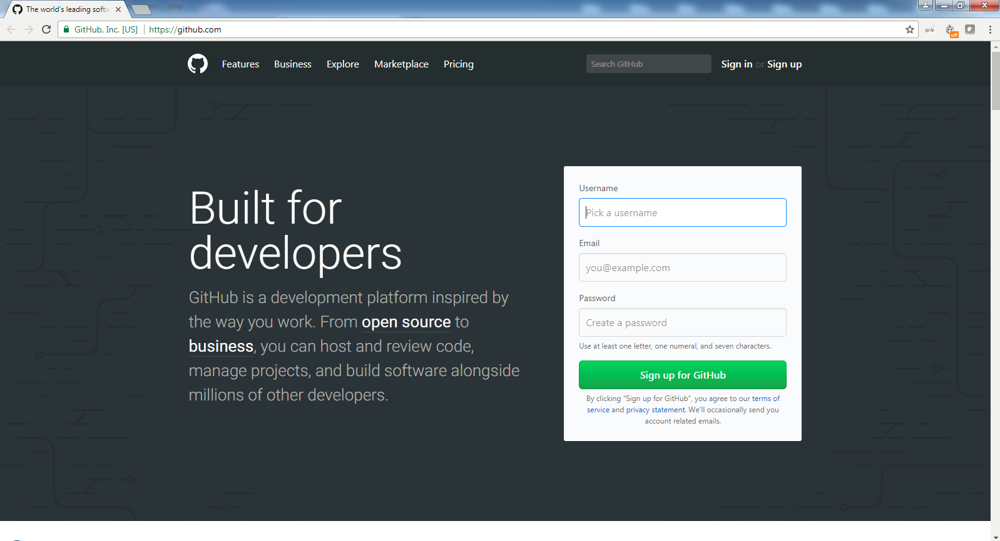
	* Pick a username.
	* Enter an email.
	* Create a password.
	* Click **Sign up for Github**.

2. Fork the banking application from this Github repository to your own Github repository.

	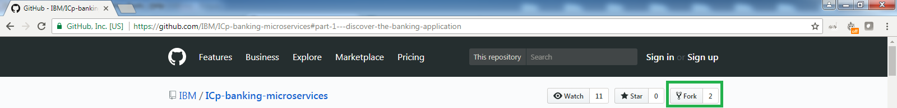
	* Click **Fork**.

3. Install the [Git command line interface](https://git-scm.com/book/en/v2/Getting-Started-The-Command-Line) to manage your Github repository.
	* Use *git clone* command to have have a local copy of source codes from a Github repository.
	* Use *git pull* command to get fresh code from your Github repository.
	* Use *git push* command to push new code to your Github repository.

4. Launch a terminal and clone your GitHub repository to have a local copy of your banking application:

   `git clone https://github.com/YOUR_USERNAME/YOUR_REPOSITORY_NAME`
    
	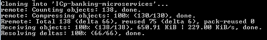
	
5. Import the source code into your favorite IDE and take a look of the *banking-application* folder:

	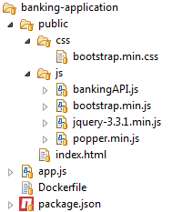
	* *app.js*: the Node.js application (server code).
	* *public/index.html*: the banking application (client code).
	* *public/css*: the banking application stylesheet.
	* *public/js*: Javascript libraries. *bankingAPI.js* will be modified later to connect the banking application to a real corebanking system through API calls (part 2).
	* *package.json*: the package dependency file
	* *Dockerfile*: file to build the docker file. it will be used later.

## Part 2 - Subscribe to the banking API through the API Developer Portal

1.	Sign up for an [IBM ID] if you don't have one already.

2.	Go to the [API Developer Portal].

3. Create an account if you have not done that already.

	
   * Click **Create an Account**.
   * Provide all required information. Be sure to use your IBM ID (email address) for this account.
   * Click **Submit**.

  
   An account activation email will be sent to your registered IBM ID email. Click on the link in this email to activate your account.

4. Login to your account.

5. Create a new application.
	
	* Click **Apps** from the menu.
	* Click **Create new App**.
	* Fill in all required fields.
	* Click **Submit**.
	
	Make a note of the *client ID* and *client Secret*. You will need them to access the API later.
	

6.	Before working with the banking API, you need to subscribe to it first. Display the list of available API products.
	
	* Click **API Products** from the top menu.
	* Click **Banking Product** in the list.

7. 	Subscribe to the Banking API.
	
	* Click **Subscribe** to the Default Plan.
	
	
	* Select the App that you have just created before.
	* Click **Subscribe**.
	
8. Modify the *banking-application/js/bankingAPI.js* in your banking application.
	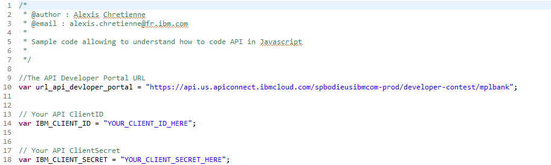
	* Replace *YOUR_CLIENT_ID_HERE* by your client ID value from the IBM API developer portal.
	* Replace *YOUR_CLIENT_SECRET_HERE* by your client Secret value from the IBM API developer portal.

## Part 3 - Run the banking application with Node.js

1. Install components for your environment (Windows, Mac OS, Linux):
	*	[Node.js](https://nodejs.org/en/): Node.js is javascript server and will run the banking application.
	* 	[npm](https://www.npmjs.com/get-npm): npm resolves Node.js package dependencies. According to your operating system, npm may be distributed with Node.js.

2. Launch a terminal. Go to your repository root folder:

    `cd YOUR_REPOSITORY_NAME`

    - From the app root folder, launch the app:

    `node banking-application/app.js`

3. Launch a web browser and go to **localhost:3000**. The banking application appears.
    
	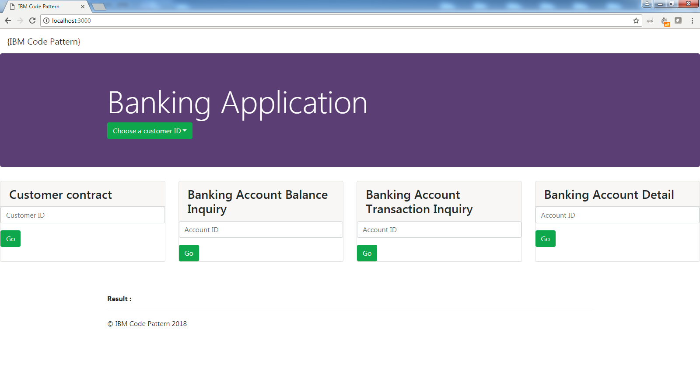

4. Test your application.

	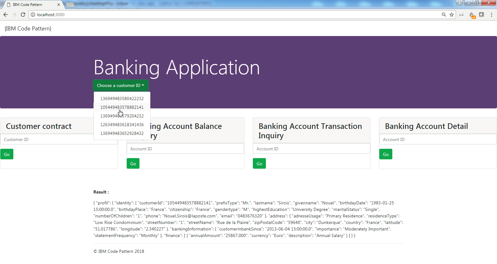
    * Select a customer ID.
    * Please wait during the application calls banking data from the Mainframe through API Connect and z/OS Connect EE.
    * The result is displayed in a JSON structure.
    
4. The banking application locally works, stop the Node.js server with a **SIGINT (CTRL+C)** from the terminal.

## Part 4 - Push the banking application to your GitHub repository

1.	Commit the fresh code you modified to add changes to the local repository:

   `git commit -m "Update of bankingAPI.js"`

2.	Push the code you commited to transfer the last commit to your Github repository:

   `git push"`

---

:thumbsup: Congratulations! Your banking application locally works and modifications have been pushed to your Github repository! Ready for IBM Cloud private ?

---

# Step 2 - Build and deploy a docker image to IBM Cloud private

The objective is to build a docker image from the banking application and then deploy it to the IBM Cloud private.

## Part 1 - Build the Docker image

Docker can build images automatically by reading the instructions from a Dockerfile. A Dockerfile is a text document that contains all the commands a user could call on the command line to assemble an image. Using docker build users can create an automated build that executes several command-line instructions in succession.

1. Take a look in the *banking-application/Dockerfile*:

	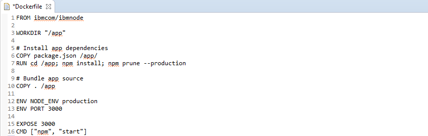
	* *FROM ibmcom/ibmnode*: it targets the system
	* *WORKDIR "/app"*: ...
	* *COPY package.json /app/*: ...
	* ...

## Part 2 -  Deploy the docker image to IBM Cloud private

Jenkins is an open source automation server. It helps to automate the non-human part of the software development process, with continuous integration and facilitating technical aspects of continuous delivery. It supports version control tools, including Git, and can execute shell scripts. In this Code Pattern, Jenkins has been setup in the ICP worker node on Linux on Z. It is used to automatically build a docker image from a Github repository to comply with a DevOps approach. After the build process, Jenkins deploys the Docker image to Docker repository in the ICP worker node based on Linux on Z.

1. Connect to [Jenkins](http://148.100.92.185:8080/job/docker-build-icp/build?delay=0sec).

2. Select values before building the Docker image:

	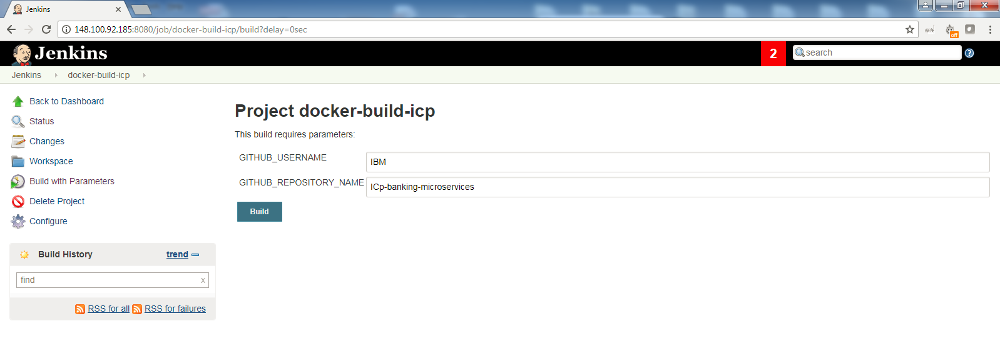
	* Replace *GITHUB_USERNAME* by your own Github username.
	* Replace *GITHUB_REPOSITORY_NAME* by your own Github repository name

3. Click **Build**.
	
	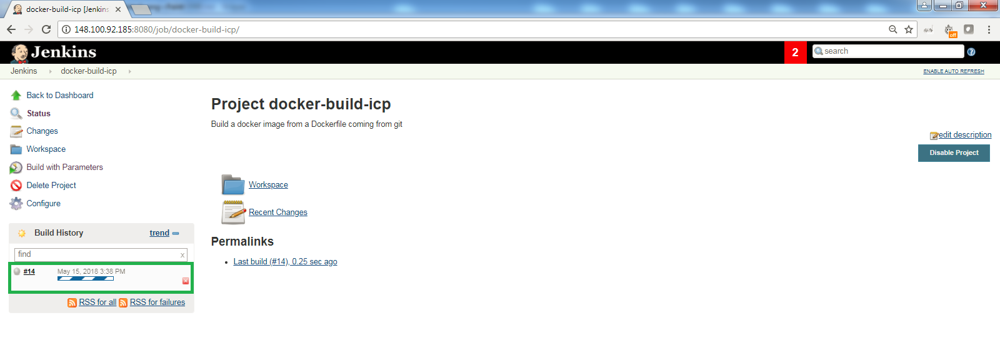
	* A new build has been submitted into Jenkins and is in progress.
	
	
4. Wait for the successful completion of your build:

	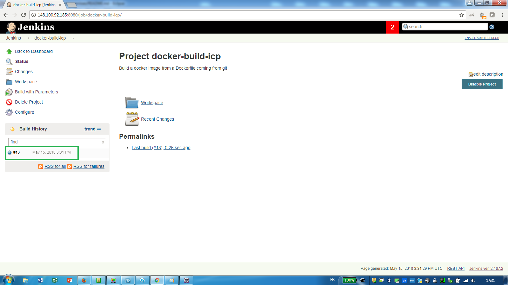
	
5. Select your build then click **Console Ouptut** and **View As plain text** to display the build output
	
	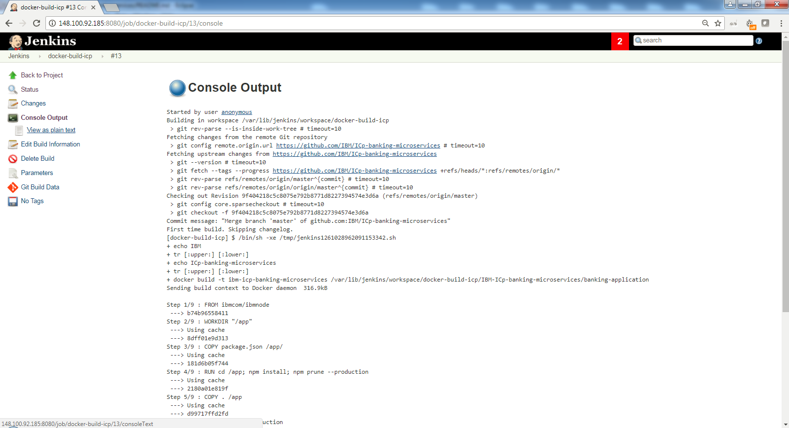

6.  Read the build output to understand how the Jenkins build has been executed:
	
	* Jenkins pulled your source code from yout Github repository.
	* Jenkins built the Docker image from the Docker file described before.
	* The Docker build action automatically added it to the Docker image repository of the ICP worker node on Linux on Z. Your banking application is now ready to be instantiated from the ICP catalog.

---

:thumbsup: Congratulations! Your banking application has been packaged into a Docker image using a DevOps approach ! Ready to use it from IBM Cloud Private ?

---

# Step 3 - Instantiate the banking microservice from the IBM Cloud private catalog

The objective is to discover the IBM Cloud Private catalog in order to instantiate a container from your Docker image containing your banking application. In this way, you will be able to test your banking application from ICP.

## Part 1 - Discover the Helm chart from the calalog

1. Login to the [IBM Cloud Private catalog] () and fill credentials:
	
	
    * Replace the username: `****`
    * Replace the password: `****`

3. Go to the catalog from the menu.

	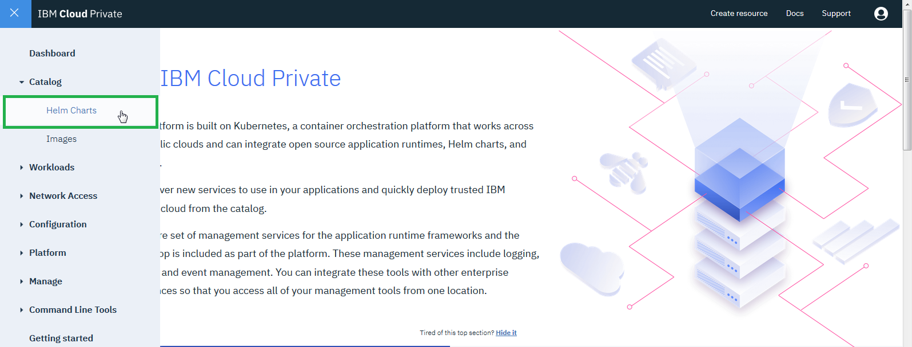
	* Click on **Catalog** then **Helm Charts**.

4. Display customized Helm Charts, including a published helm chart for the banking application

	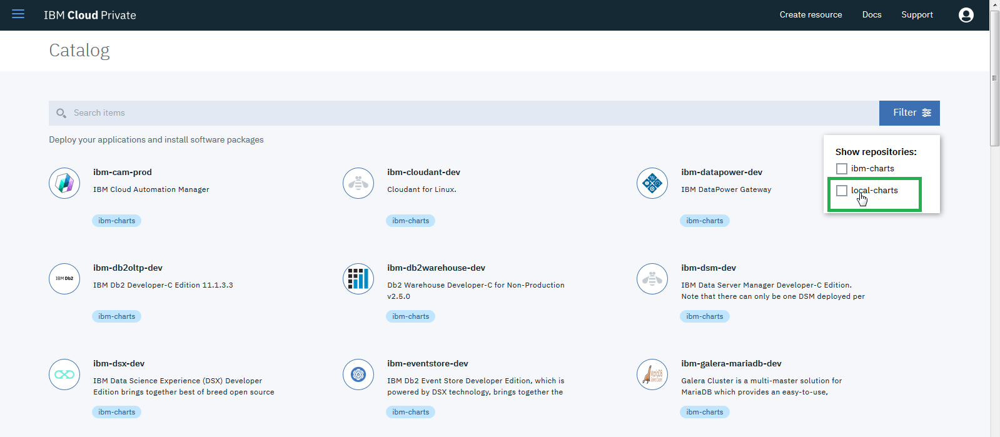
	* Click on **Filter**
	* Check **local-charts** to display customized charts.

5. Click on the Helm Chart called **Banking Application** to see the overview of the this banking microservice.

	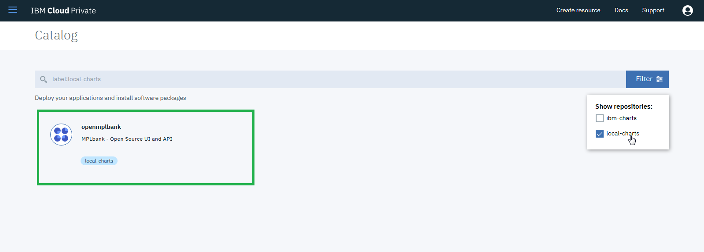

	

## Part 2 - Configure and install your banking microservice

1. Select your banking microservice to prepare your container.

	
	* Click **Configure**.

2. Configure the banking microservice to instantiate a container from your Docker image built in the previous step:

	
	* Fill the release name with *banking-application-YOUR_USERNAME*.
	* Set the default namespace to *default*.
	* Fill Image repository to your Docker image called *banking-application-YOUR_USERNAME*.

3. Click the **Install** button. When the process is finished, click **View Helm Release**

## Part 3 - Access your banking microservice
1. Click on the only **deployment** available 

2. Select **access http** under the **Expose details** panel and enjoy your new app!

#Troubleshooting
#Privacy Notice
#Links

[IBM ID]: https://www.ibm.com/account/us-en/signup/register.html
[API Developer Portal]: https://developer-contest-spbodieusibmcom-prod.developer.us.apiconnect.ibmcloud.com/
