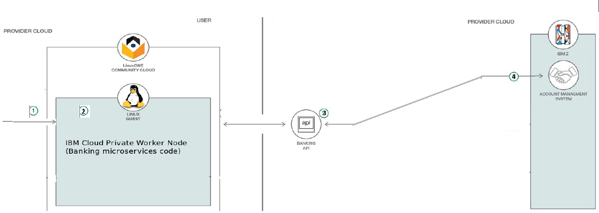

# Create and deploy a financial microservice to Linux on Z using IBM Cloud Private 

In this Code Pattern, you will build and deploy a banking microservice with IBM Cloud private running in the LinuxONE Community Cloud. 

IBM Cloud Private is a private cloud platform for developing and running workloads locally. It is an integrated environment that enables you to design, develop, deploy and manage on-premises, containerized cloud applications behind a firewall. It includes the container orchestrator Kubernetes, a private image repository, a management console and monitoring frameworks.

When you will complete this Code Pattern, you will understand how to:

* Build a Docker image from an existing application.
* Deploy a Docker image to IBM Cloud Private.
* Deploy a Helm chart.
* Use the catalog from IBM Cloud Private.

# Architecture

This journey accesses a fictitious retail banking system called MPLbank. MPLbank integrates an Account Management System running on IBM Mainframe. On top of this component, an API layer based on IBM API Connect has been set up to deliver a banking API. It makes banking services reachable through API from all kind of applications. IBM Cloud private has been configured into the LinuxOne LinuxONE Community Cloud.

1. The user deploys the application based microservice on the worker Node on Linux on Z using IBM Cloud Private.
2. The user installs and runs an instance of his microservice from IBM Cloud Private. The application calls a banking API published in API Connect.
3. API Connect calls the back-end Z Mainframe through a banking API published in z/OS Connect EE.
4. z/OS Connect EE calls the Account Management System (AMS) running in CICS. A COBOL program processes the request and returns banking data. Finally, banking data are sent back to microservice application in the Worker Node on Linux on Z.

# Included components

* [IBM LinuxOne](https://www.ibm.com/it-infrastructure/linuxone)
* [IBM Cloud private](https://www.ibm.com/cloud/private)
* [IBM Z Mainframe](https://www.ibm.com/it-infrastructure/z)
* [IBM z/OS Connect Enterprise Edition](https://www.ibm.com/us-en/marketplace/connect-enterprise-edition)
* [IBM CICS Tansaction Server](https://www.ibm.com/us-en/marketplace/cics-transaction-server#product-header-top)
* [IBM Db2](https://www.ibm.com/analytics/db2/zos)

# Featured technologies

* [microservice](https://www.ibm.com/cloud/garage/architectures/microservices/)
* [IBM LinuxOne](https://www.ibm.com/it-infrastructure/linuxone)
* [IBM Cloud private](https://www.ibm.com/cloud/private)

# Steps

<!-- https://ecotrust-canada.github.io/markdown-toc/ -->

### Step 1 - Discover and locally run the banking application

- [Part 1 - Discover the banking application](#part-1---discover-the-banking-application)
- [Part 2 - Subscribe to the banking API through the API Developer Portal](#part-2---subscribe-to-the-banking-api-through-the-api-developer-portal)
- [Part 3 - Run the banking application with NodeJS](#part-3---run-the-banking-application-with-nodejs)
- [Part 4 - Push the banking application to your GitHub repository](#part-4---push-the-banking-application-to-your-github-repository)

### Step 2 - Build and deploy a docker image to IBM Cloud private

- [Part 1 - Build the Docker image](#part-1---build-the-docker-image)
- [Part 2 - Deploy the docker image to IBM Cloud private](#part-2---deploy-the-docker-image-to-ibm-cloud-private)

### Step 3 - Build and deploy an Helm chart to the IBM Cloud private catalog

- [Part 1 - Create the Helm chart](#part-1---create-the-helm-chart)
- [Part 2 - Configure the Helm chart](#part-2---configure-the-helm-chart)
- [Part 3 - Package and deploy your Helm chart to the IBM Cloud private catalog](#part-3---package-and-deploy-your-helm-chart-to-the-ibm-cloud-private-catalog)

### Step 4 - Instantiate the banking microservice from the IBM Cloud private catalog

- [Part 1 - Discover your Helm chart from the calalog](#part-1---discover-your-helm-chart-from-the-calalog)
- [Part 2 - Configure and install your banking microservice](#part-2---configure-and-install-your-banking-microservice)
- [Part 3 - Access your banking microservice](#part-3---access-your-banking-microservice)

---

# Step 1 - Discover and locally run a banking application
## Part 1 - Discover the banking application
## Part 2 - Subscribe to the banking API through the API Developer Portal
## Part 3 - Run the banking application with NodeJS

2. Clone your GitHub repository:
    `git clone https://github.com/YOUR_USERNAME/YOUR_REPOSITORY_NAME`

1. Log in onto your development system, then install **Node.js**, **NPM**, and the **Git CLI**

2. Make sure the app is working: (TO MOVE TO STEP 1?)
    - Go to your repository root folder:

    `cd YOUR_REPOSITORY_NAME`

    - From the app root folder, launch the app:

    `node banking-application/app.js`
    
    - If it works without any issue, stop the server with a **SIGINT (CTRL+C)**.

## Part 4 - Push the banking application to your GitHub repository
1. Connect to your GitHub account or create one, it's free! Your username will be **YOUR_USERNAME**
2. Create a new repository and name it `icp-code-pattern-YOUR_USERNAME` (OR FORK THE REPO?!), this will be **YOUR_REPOSITORY_NAME**

# Step 2 - Build and deploy a docker image to IBM Cloud private
## Part 1 - Build the Docker image

1. Push your code to your Git repository
    - Commit your changes:

    `git add .`
    `git commit -m "my message"`
    
    - Push your changes:

    `git push`

## Part 2 -  Deploy the docker image to IBM Cloud private
1. Connect to the ICP Worker Node

2. Clone your repository
    - From the folder where you want your projet to be cloned:
    
    `git clone https://github.com/YOUR_USERNAME/YOUR_REPOSITORY_NAME`

3. Build the docker image
    - Go inside the app folder:
    
    `cd YOUR_REPOSITORY_NAME/banking-application`
    
    - Build the image:
    
    `docker build -t banking-application-YOUR_USERNAME:latest .`

    This step will build a **Docker image** and host it on the Worker Node's image repository, according to the steps written in the **Dockerfile**.

# Step 3 - Build and deploy an Helm chart to the ICP catalog
## Part 1 - Create the Helm chart
1. Go back to your development system

2. Create your helm chart   
    `helm create helm-chart-YOUR_USERNAME`

3. Go to your chart folder
    `cd helm-chart-YOUR_USERNAME`

## Part 2 - Configure the Helm chart
(Steps to create the files and configure the values)

10. Validate the Helm chart:
    - Go to the parent folder:
    
    `cd ..`

    - Analyse and validate the chart:
    `helm lint helm-chart-YOUR_USERNAME`

## Part 3 - Package and deploy your Helm chart to ICP
1. Package the Helm chart
    
    `helm package helm-chart-YOUR_USERNAME`

2. Connect to ICP
    - Execute this command:

    `bx pr login -a https://MASTER_NODE_IP:PORT --skip-ssl-validation`
    
    - When prompted, type in these credentials:
        - Username: `admin`
        - Password: `admin`
        - Select an account: `1`
 
3. Upload the package to ICP
    `bx pr load-helm-chart --archive helm-chart-YOUR_USERNAME-0.1.0.tgz --clustername MASTER_NODE_IP`

# Step 4 - Instantiate the banking microservice from the IBM Cloud private catalog

## Part 1 - Discover your Helm chart from the calalog
1. Connect to the ICP Web UI through your Web browser, on **ICP_MASTER_NODE:PORT**

2. When prompted, type in these credentials then :
    - Username: `admin`
    - Password: `admin`

3. Click on the top-left *hamburger* icon, then select the **Catalog** option

4. Right to the catalog search bar, click on **Filter** then on the **local-charts** checkbox

5. Search for your chart named **helm-chart-YOUR_USERNAME** and click on its card

## Part 2 - Configure and install your banking microservice

1. Bottom-right on your Helm chart page, click **configure**

2. When prompted, use `banking-application-YOUR_USERNAME` as your release name and select **default** as the target namespace

3. Scroll down to the bottom and click the **Install** button. When the process is finished, click **View Helm Release**

## Part 3 - Access your banking microservice
1. Scroll down and click on the only **deployment** available 

2. Select **access http** under the **Expose details** panel and enjoy your new app!

#Troubleshooting
#Privacy Notice
#Links